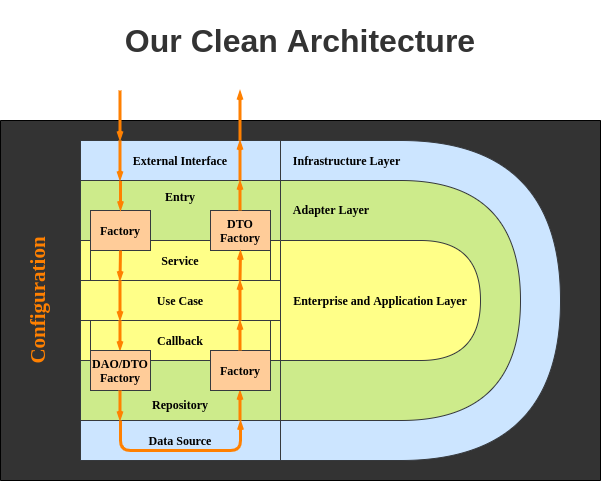

# Clean Arch Example

An implementation of Clean Architecture in Scala. We will implement a simple blog application using Clean Architecture in Scala.
The bellow image is a schematic of our clean architecture style.

## Subprojects:

I will walk through the following projects to show the process of creating a Scala Application using Clean Architecture and some frameworks:

1. [Clean Architecture](#1-clean-architecture)
    1. [Template](#1-template)
    2. [Domain](#2-domain)
    3. [Contract](#3-contract)
    4. [Application](#4-application)
2. [Improvements](#1-improvements)
    1. [Handling Exceptions](#1-handling-exceptions)
    2. [Future Utils](#2-future-utils)
    3. [Update with Action](#3-update-with-action)
3. [Test](#2-test)
    1. [Test](#1-test-with-scalatest)
4. [Dependency Injection](#3-dependency-injection)
    1. [Dependency Injection with Guice](#1-dependency-injection-with-guice)
5. [REST Server](#4-rest-server)
    1. [REST Server with Play](#1-rest-server-with-play)
    2. [REST Server with Finatra](#2-rest-server-with-finatra)
    3. [REST Server with Akka](#3-rest-server-with-akka)
6. [Connect to Databases](#5-connect-to-databases)
    1. [Connect to Databases using Slick](#1-connect-to-databases-with-slick)
    2. [Connect to Databases using ScalikeJDBC](#2-connect-to-databases-with-scalikejdbc)

### 1. Clean Architecture

#### 1. Template

Directories and abstraction of `contract.service.Service`.

For more information about this section visit my blog - [Clean Architecture in Scala](https://saeiddadkhah.medium.com/clean-architecture-in-scala-41d1ab05a618).

#### 2. Domain

Design of classes and implementation of simple class-related use cases.

For more information about this section visit my blog -
[Implementing a Clean Architecture Application in Scala - Part 1](https://saeiddadkhah.medium.com/implementing-a-clean-architecture-application-in-scala-part-1-1442f0438b03)
.

#### 3. Contract

Signature of services and callbacks.

* Services should extend `c.s.Service` and have only one public method which is `c.s.Service.call`.
* Callbacks should contain only the abstraction of CRUD operations without any logic.
* Callbacks do not take execution context as a parameter and should take one from their parent module _(R.T. #4 Application)_.

For more information about this section visit my blog -
[Implementing a Clean Architecture Application in Scala - Part 1](https://saeiddadkhah.medium.com/implementing-a-clean-architecture-application-in-scala-part-1-1442f0438b03)
.

#### 4. Application

Implementation of repositories, use cases, and modules.

* Repositories should implement callbacks and have only public members which their parent has.
* Use cases should implement services and should have only one public member which is `c.s.Service.call`.
* Use cases should use instances of callbacks **_(NOT repositories)_**.
* All configurations should be placed in `modules` package.
* There are three essential modules
    1. Loading the config and validating it happens in `modules.ConfigModule`.
    2. Callbacks should be bound to repositories in `modules.CallbackModule`.
    3. Services should be bound to use cases in `modules.ServiceModule`.
* Each type of external data source and entry should have exactly one module.
    * All repositories using database should extend `modules.DatabaseModule`
    * All repositories using REST API and a special HTTP client should extend `modules.RESTModule`

Here are some tips about config files.

* An important **security** point is **_NOT_** to commit config files.
  Put some entries to ignore config files in `.gitignore` file.
    * `application.conf`
    * `application.staging*.conf`
    * `application.prodcution*.conf`
* Store all config files in one directory i.e. the project root, `resources`.
  I recommend using `resources` directory.
* It is essential to specify the template of config file, and I recommend committing `application.template.conf` with dummy values.
* There are multiple ways to specify the config file which we want to run the application with.
  We are using `config` library of `com.typesafe` to load configs.
    * It utilises [HOCON](https://github.com/lightbend/config/blob/main/HOCON.md) files to load configs.
    * Expectedly, this library offers `c.t.c.ConfigFactory.parseFile` function to parse config file.
      You may set an environment variable to specify the config file and load it using this function.
    * A more elegant method is to use `-DConfig.file` JVM option and use this function
      `ConfigFactory.load().withFallback(ConfigFactory.defaultApplication()).resolve`.

### 1. Improvements

#### 1. Handling Exceptions

Reserved

#### 2. Future Utils

Reserved

#### 3. Update with Action

Reserved

### 2. Test

#### 1. Test with ScalaTest

RESERVED

#### 2. Test with ScalaTest and Mockito

RESERVED

### 3. Dependency Injection

#### 1. Dependency Injection with Guice

Initialized.

### 4. REST Server

#### 1. REST Server with Play

RESERVED

#### 2. REST Server with Finatra

Initialized.

#### 3. REST Server with Akka

RESERVED

### 5. Connect to Databases

#### 1. Connect to Databases with Slick

RESERVED

#### 2. Connect to Databases with ScalikeJDBC

RESERVED

## Read More

For more information about this repository, visit my [blog](https://saeiddadkhah.medium.com/).

## Contributing

Please create an issue to suggest a new concept, framework, or library.

Implement current concepts using mentioned frameworks or libraries, and send a PR. PRs are always welcome.
